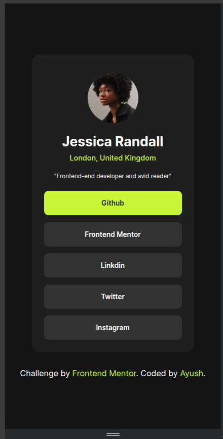

# Frontend Mentor - Social links profile solution

This is a solution to the [Social links profile challenge on Frontend Mentor](https://www.frontendmentor.io/challenges/social-links-profile-UG32l9m6dQ). Frontend Mentor challenges help you improve your coding skills by building realistic projects. 

## Table of contents

- [Overview](#overview)
  - [The challenge](#the-challenge)
  - [Screenshot](#screenshot)
  - [Links](#links)
- [My process](#my-process)
  - [Built with](#built-with)
  - [What I learned](#what-i-learned)
  - [Continued development](#continued-development)
  - [Useful resources](#useful-resources)
- [Author](#author)
- [Acknowledgments](#acknowledgments)

## Overview

### The challenge

Users should be able to:

- See hover and focus states for all interactive elements on the page

### Screenshot




### Links

- Solution URL: (https://github.com/apsbundela/fem-social-links-profile)
- Live Site URL: (https://your-live-site-url.com)

## My process

### Built with

- Semantic HTML5 markup
- CSS custom properties
- Flexbox

### What I learned


#### How to Make an Image Circular
- Most CSS percentages (e.g. `width: 50%`) are relative to the **parent element**.
- `border-radius` behaves differently — its percentage values are relative to the **element itself**.
- When using `border-radius: 50%`:
  - The horizontal radius is calculated from the element’s **width**
  - The vertical radius is calculated from the element’s **height**
- If the element is a **square**, `border-radius: 50%` creates a **perfect circle**.

---

#### How to Center Inner Content Inside a Block Element  
*(How I centered the image inside the card)*

- The `text-align` CSS property controls the **horizontal alignment** of inline-level content inside a block element.
- Applying `text-align: center;` to the parent element centers images and text inside it.

---

#### Transition Property
- The CSS `transition` property helps create **smooth UI changes** instead of instant jumps.
- Commonly used for hover, focus, and active state animations.
---

#### How to Add Static Fonts Using `@font-face`
- Learned how to load custom fonts locally using the `@font-face` rule.
- Defined a font family and linked it to a local `.ttf` font file.
- Used a variable font with a supported weight range (`100–900`).

```css
@font-face {
  font-family: "Inter";
  src: url("./assets/fonts/Inter-VariableFont_slnt,wght.ttf") format("truetype");
  font-weight: 100 900;
  font-style: normal;
}

## Author

- Frontend Mentor - [@yourusername](https://www.frontendmentor.io/profile/@apsbundela)
- Twitter - [@yourusername](https://www.twitter.com/@apsbundela)
